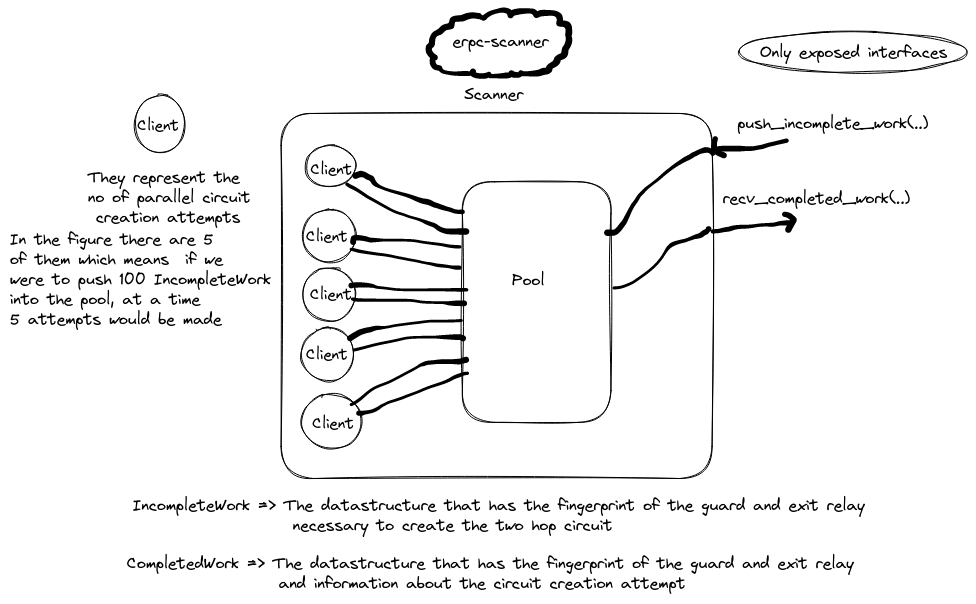
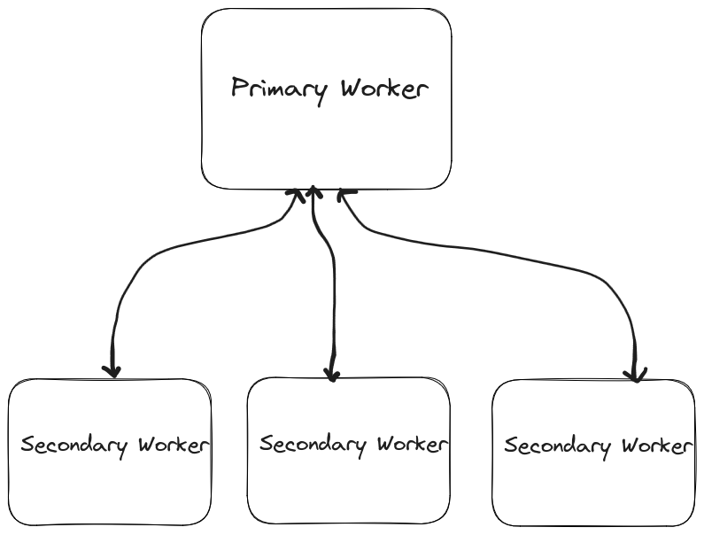
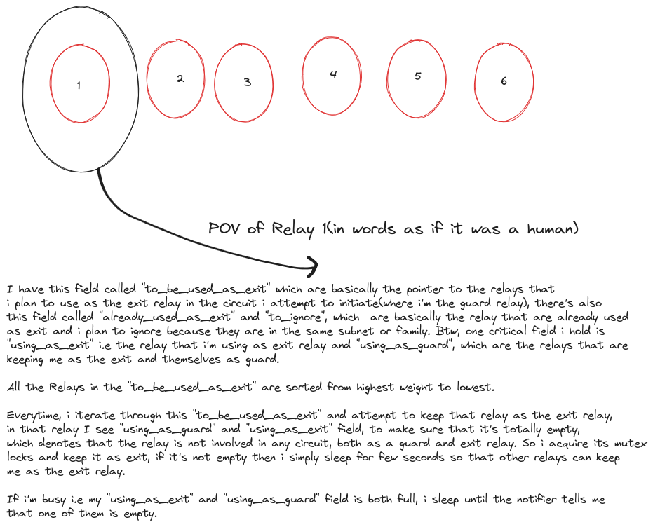
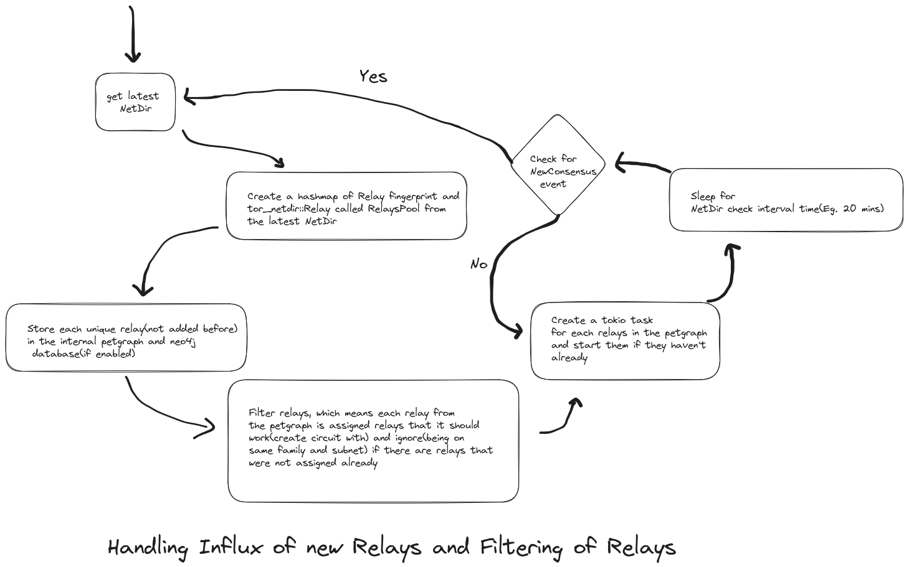
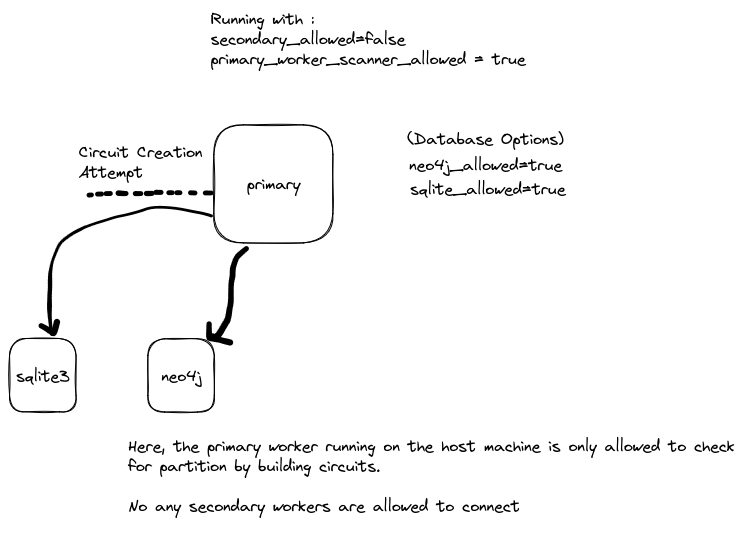
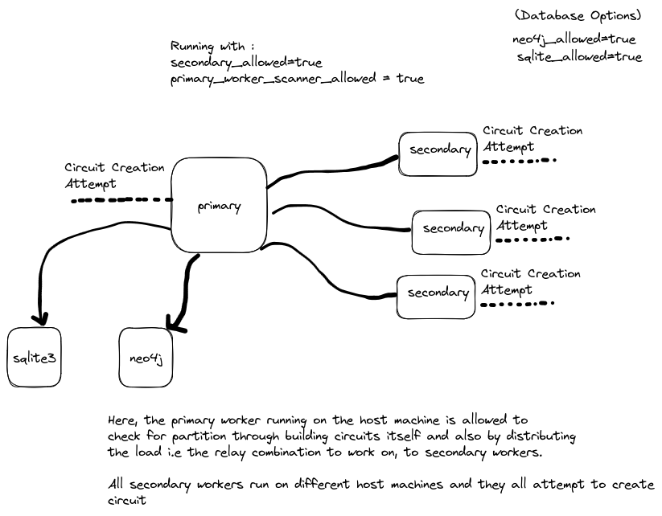
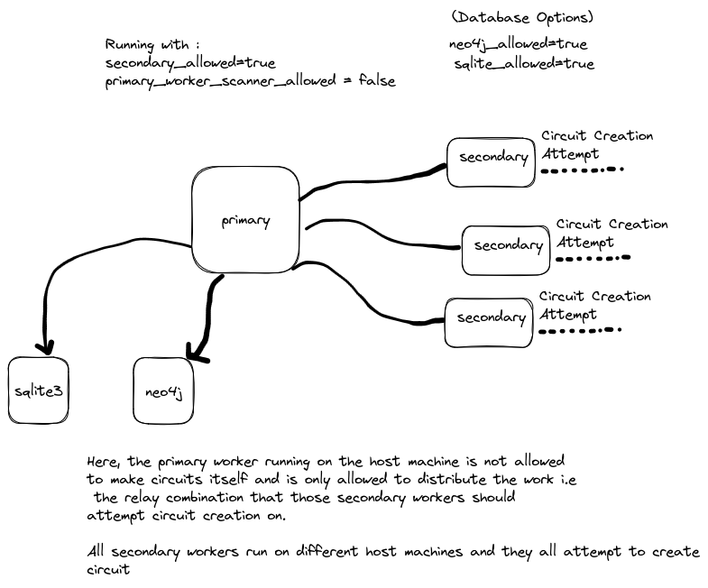

# eRPC - An efficient Relay Partition Checker

## Why this project?

Within the Tor Network, if there is a partition among relays or this inability of relay(s) to communicate with other relay(s), it has a harsh impact on the Tor Network. This application **erpc** aims to be the tool that scans for possible partitions within the Tor Network, so that the resulting data can be used to monitor those possible partitions and their cause, and can be worked on later.

## Goals :
- Create a gRPC based distributed scanner that can be used to distribute the partition scanning in balanced way among its workers.
- Create a powerful configuration that can tweak the application behavior as the user wants.
- Create a gRPC based interface to tweak some application configs during the runtime, so that the application configuration changes during the runtime itself and also provide features to pause and resume scan through the interface itself.
- Generate the data in the given output format or through the interface as the user wants.
- Ability to scan partitions among every relay or desired relays through two hop circuit creation test.

## Issues faced by other similar projects:
- There are around ~**6800** relays out there and which means around ~**46
million** relay combinations(both directions considered). It’s a lot of 2 hop
circuits to build if we are to test them all. In the conversation of "[Measure
connectivity patterns between relays](https://gitlab.torproject.org/tpo/network-health/analysis/-/issues/1)" there’s a talk about testing all possible
2 hop circuits, per day 10% of the circuits seem to have been created and
in 3+ weeks, connection between two relays were tested 6 times among
6730 relays. So, creating 2 hop circuits millions of times is a very sensitive thing, considering the load on the network it needs to be done at a specific pace, in which each relay reacts to creating circuits differently depending upon its bandwidth, consensus weight.
- What if a relay is down, rather than blocked? How are different outputs
segregated and visualised?
- All the application and network level issues mentioned at [Onion Graph
Known issues](https://github.com/teor2345/onion-graph#known-issues)


## Application Design
The application has a distributed worker architecture where it uses gRPC as its communication protocol. Here from the diagram below, we can see that there is this notion of **primary** worker that controls the **secondary** workers by distributing the work among the **dynamically connected** secondary workers. The work here is nothing but testing of circuits among specified relays. Batches of work represent the small chunks of work provided, which the secondary worker finishes and returns its result back to **primary** worker. The configuration within the secondary worker is controlled by the **primary** worker unless the configuration is explicitly mentioned in the secondary worker's configuration file.

Currently we have 2 libraries, ```erpc-scanner``` and other is ```erpc-metrics(yet to work on)``` and two binaries within ```erpc-worker```, they are ```primary``` worker and ```secondary``` worker.

Let's talk about the library ```erpc-scanner```,

This library consists of all the codes necessary to turn a desired two hop circuit combination into a circuit creation attempt. There's this core type called ```Scanner```, which abstracts away all the inner details and only exposes two methods to deal with, ```push_incomplete_work(..)``` and ```recv_completed_work(..)```. In the figure below, there are these ```Client``` that act as a type indirection for ```CircMgr``` of arti-client and they are responsible for using the ```CircuitBuilder``` to create circuits. The ```IncompleteWork``` is the information about the 2 hop circuit to be created i.e the guard and exit relay, and ```CompletedWork``` is the result of circuit creation attempt.
{:width="600" height="500"}


{:width="600" height="500"}

## Scanning Strategy
Let's imagine we have 1000 relays. Currently in this application, it creates these type called ```Node``` for each of those 1000 Relay, each ```Node``` contains fields called ```to_be_used_as_exit``` and ```to_be_ignored``` and it contains pointer to the ```Node``` that it should use as an exit relay and who it should not(one that are in the same subnet, same family and itself) respectively. Using this information a ```Node``` attempts  to use the other ```Node``` as an exit relay, in this way all 1000 ```Node``` attempt to keep every other one as the exit relay, but at a time a ```Node``` gets to be in only one circuit either as a ```guard``` or ```exit```, but not both i.e it's not allowed to be involved in multiple circuits at a time. We're only creating one circuit at any instant in time. The ```to_be_used_as_exit``` field is filtered based on the highest to lowest consensus weight, this way we are building the most probable circuits first.

Here's the POV that **every Relay** goes through:


## Handling Influx of new Relays and filtering Relays to/not make circuit with

Currently we have this [NetDirProvider](https://gitlab.torproject.org/tpo/network-health/erpc/-/blob/main/erpc-scanner/src/relay.rs#L18), which abstracts the ```DirMgr``` from arti, this ```DirMgr``` has a stream that gives out a type called ```DirEvent```, which represents that the NetDir has been changed, so in ```NetDirProvider```, we listen for this event and then broadcast a fresh ```NetDir``` in the broadcast channel that the ```NetDirProvider``` has and it also gets hold on the latest ```NetDir``` [here](https://gitlab.torproject.org/tpo/network-health/erpc/-/blob/main/erpc-scanner/src/relay.rs#L38). So, everytime the ```DirEvent::NewConsensus``` is received from the stream of events of ```DirMgr```, we update the ```NetDir```.

Within **erpc**, we have this type called ```TorNetwork```, which is responsible for creating the combinations of two hop circuits. The [start](https://gitlab.torproject.org/tpo/network-health/erpc/-/blob/main/erpc-workers/src/primary/tor_network.rs#L150) method is responsible for starting this ```TorNetwork```, initially it gets the ```NetDir``` from the [get_current_netdir](https://gitlab.torproject.org/tpo/network-health/erpc/-/blob/main/erpc-scanner/src/relay.rs#L81) method. Then we store information about each **unique** Relay from the ```NetDir``` to the petgraph that and the configured graph database. After that, we filter each relay, by filtering it means that each relay is taken and all the relay that are it's family are in the same subnet ignored to build circuits. This cycle is continued for every new ```NetDir``` received through ```NetDirProvider``` receive half of the broadcast channel.


## Configure and Run :


### Important terms:
Let's understand few notions before we get into running the application. The term [IncompleteWork](https://gitlab.torproject.org/tpo/network-health/erpc/-/blob/main/erpc-scanner/src/work.rs#L18) refers to the data structure that simply stores the **fingerprint** of the first hop(```source_relay```) and second hop(```destination_relay```) of the two hop circuit
```rust
pub struct IncompleteWork {
    /// Metadata to identify the source relay
    pub source_relay: String,

    /// Metadata to identify the destination relay
    pub destination_relay: String,
}
```
and this data on ```IncompleteWork``` is then used to make circuit creation attempt and the result of this circuit creation attempt is stored in a data structure called [CompletedWork](https://gitlab.torproject.org/tpo/network-health/erpc/-/blob/main/erpc-scanner/src/work.rs#L50), which contains the same informations as ```IncompleteWork```, with few extra information such as how the work **two hop circuit** attempt went, ```Successful``` or ```Failed```.
```rust
#[derive(Debug, Clone)]
pub struct CompletedWork {
    /// Fingerprint to identify the source relay
    pub source_relay: String,

    /// Fingerprint to identify the destination relay
    pub destination_relay: String,

    /// Shows how the work was completed, was it a success or failure
    pub status: CompletedWorkStatus,

    /// The Unix epoch at which the test was performed
    pub timestamp: u64,
}

```
```rust
pub enum CompletedWorkStatus {
    /// The circuit creation attempt successful
    Success,

    /// The circuit creation attempt failed with an error
    Failure(String),
}
```

Now, we're ready to configure the application.

### Configuring Distribution

There are 3 different **modes** on the basis of **distribution**, in which you can run this application. Let's go through each distribution mode.

#### (i) Running only Primary Worker Scanner

The **primary** worker running on a host machine will only be allowed to to create circuits and check for partition, it **won't be allowed** to run gRPC service for the Secondary Workers, so that the work can't be distributed. It means everything is isolated within the **primary** worker.
{:width="600" height="500"}

To set this mode, you should add the following in the [config file](https://gitlab.torproject.org/tpo/network-health/erpc/-/blob/main/config/primary/Config.toml)
```toml
# The gRPC server for Secondary Workers is turned off
secondary_allowed = false

# The Primary Worker is allowed to scan for partitions by creating circuits
primary_worker_scanner_allowed = true
```

#### (ii) Running only gRPC Service for Secondary Workers

The **primary** worker running on the host machine is not allowed to create circuits and check for partition on the host machine it's running on, it only runs the gRPC Service for the secondary workers, where it distributes the ```IncompleteWork`` i.e the relay combinations of which the circuit is to be created, to the secondary workers.

{:width="600" height="500"}

To set this mode, you can add the following in the [config file](https://gitlab.torproject.org/tpo/network-health/erpc/-/blob/main/config/primary/Config.toml)

```toml
# The gRPC server for secondary workers is turned on
secondary_allowed = true

# The Primary Worker is not allowed to create circuits and check for partitions itself.
primary_worker_scanner_allowed = false
```


#### (iii) Running both Primary Worker Scanner and gRPC Service for Secondary Workers

The **primary** worker running on the host machine is allowed to create circuits and check for partition on the host machine it's running on **and** it also runs the gRPC Service for the secondary workers, where it distributes the ```IncompleteWork`` i.e the relay combinations of which the circuit is to be created, to the secondary workers.

{:width="600" height="500"}


**NOTES** :
- If you have set ```secondary_allowed = true```, then you must add the following in the ```.env``` file of both the **primary** and **secondary** worker.

For [.env](https://gitlab.torproject.org/tpo/network-health/erpc/-/blob/main/config/primary/.env) file in **primary** worker:
```
# The gRPC interface to run on
SECONDARY_WORKER_GRPC_SERVER_ADDR = "0.0.0.0:10000"
```

For [.env](https://gitlab.torproject.org/tpo/network-health/erpc/-/blob/main/config/secondary/.env) file in **secondary** worker:
```
# The URL of the primary worker gRPC server
PRIMARY_WORKER_GRPC_SERVER_URL = "http://<MASTER_WORKER_IP>:10000"
```
- Run only one secondary worker per host machine, because the indexing of each secondary is done through it's IP address, running multiple secondary workers on the same IP will create issues.

### Configuring Database

Also, for the database you have the options to either use ```sqlite3``` or ```neo4j```.
You have the option to use **both** or any **one of them** by providing configurations in the [config file](https://gitlab.torproject.org/tpo/network-health/erpc/-/blob/main/config/primary/Config.toml)

Example :
```toml
# Uses neo4j database to save the data produced
neo4j_allowed = true

# Uses sqlite database to save the data produced
sqlite_allowed = true
```
You can use **sqlite3** if you want to run the application quick without any database setup.

But, if you are seeking for extra visualization of data and features you can spin a **neo4j** database, you can do it through docker, to do that, install docker through from [here](https://docs.docker.com/engine/install/) and after than you can pull the latest image of **neo4j** through ```docker pull neo4j:latest``` and run neo4j container as mentioned [in this documentation](https://neo4j.com/developer/docker-run-neo4j/) i.e.
```bash
docker run \
    --name testneo4j \
    -p7474:7474 -p7687:7687 \
    -d \
    -v $HOME/neo4j/data:/data \
    -v $HOME/neo4j/logs:/logs \
    -v $HOME/neo4j/import:/var/lib/neo4j/import \
    -v $HOME/neo4j/plugins:/plugins \
    --env NEO4J_AUTH=neo4j/password \
    neo4j:latest
```
where **neo4j** is the username and **password** is the password, the ports are explained well in
[in the same documentation](https://neo4j.com/developer/docker-run-neo4j/) properly, after you have a running container of neo4j, you can simply go to the **.env** file at the [configuration](https://gitlab.torproject.org/tpo/network-health/erpc/-/tree/main/config/primary) of the primary worker and put the neo4j credentials there.

### Running Secondary Worker and connecting to Primary Worker:

- Clone the repo using ```git clone https://gitlab.torproject.org/tpo/network-health/erpc```
- Enter into the root of the project using ```cd erpc```.
- You have the option of using **cargo** directly to run the application, or produce the **secondary** worker binary first and then run it. We'll use the **cargo** option for now.
- Make sure that you have the [.env](https://gitlab.torproject.org/tpo/network-health/erpc/-/tree/main/config/secondary) for the **secondary**, you can simply go to the config directory for the secondary worker by using ```cd config/secondary``` from the root of the repo and get that **.env** file.
- Inside the **.env** file, set the address of the gRPC server i.e the one that primary worker has configured
- After setting the environment variables, you can simply run the command ```cargo run --release --bin secondary``` in the same directory where you had the **.env** file.


## References
- <https://gitlab.torproject.org/tpo/network-health/analysis/-/issues/1>
- <https://gitlab.torproject.org/tpo/core/tor/-/issues/19068>
- <https://gitlab.torproject.org/tpo/network-health/metrics/ideas/-/issues/25775>
- <https://gitlab.torproject.org/tpo/network-health/team/-/issues/16>
- <https://lists.torproject.org/pipermail/tor-project/2017-October/001492.html>
- <https://lists.torproject.org/pipermail/network-health/2021-March/000668.html>
- <https://github.com/teor2345/onion-graph>
- <https://bitbucket.org/ra_/tor-relay-connectivity.git>
- <https://github.com/david415/tor_partition_scanner>
- <https://github.com/sachaservan/ShorTor>
